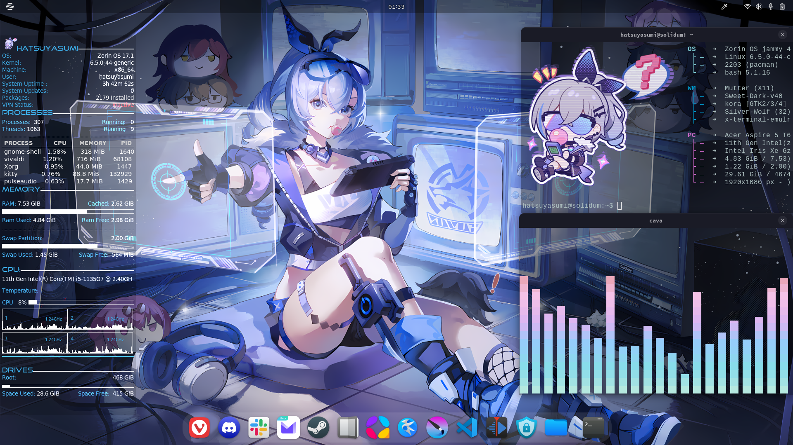

# My Silver Wolf Rice Setup

### OS:
- **Zorin OS 17.1**

### Desktop Environment:
- **GNOME with X11**

### Terminal:
- **Kitty**

### System Monitor:
- **Conky** (SystemMon4)

### Visualizer:
- **CAVA** with custom gradient colors from [Ruixi-rebirth](https://github.com/Ruixi-rebirth)

### Browser:
- **Vivaldi**
  - Custom CSS to remove the header
  - Compact layout
  - Unchecked show tab bar

### Fonts:
- **Source Code Pro**

### Themes:
- **GTK**: Tokyonight-Dark-B-LB
- **Icons**: Papirus
- **Shell**: Sweet-Dark-40

### Wallpaper:
  - [Pixiv Link](https://www.pixiv.net/artworks/109695805)

### Background Music:
- **Silver Wolf's Theme**

### Extensions:
- **User Themes**
- **Dash2Dock Animated**
- **Color Picker**
- **Blur My Shell**
- **Just Perfection**
- **Logo Menu**
- **Open Bar**
- **QSTweak**

### Rice Showcase:

